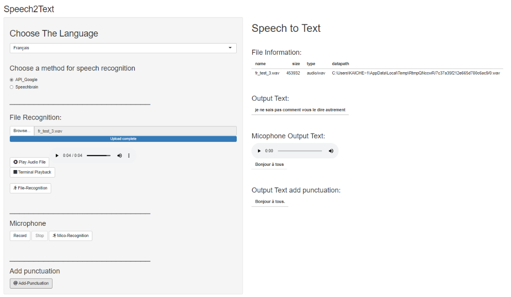

# Speech2Text

This application has been produced during the internship of @kaicheng96. It aims at providing a proof of concept of features extraction from audio records.

## Description

The application is splitted in two parts: a RShiny web interface and a Python core engine.

Features:
- Select a language between french, english, chinese;
- Choose an engine between Google API and a speechbrain model;
- Choose a file in wav OR record with your microphone;
- Run Speech2Text model;
- Run a model to add punctuation;
- Run a model to analyze emotions from audio record.

## Visuals

## Installation

### Python requirements
TODO

### R requirements
TODO

### Install application
TODO

### Run app Shiny
TODO

## Authors and acknowledgment

Thank you @kaicheng96 for all the good work you have done during your 6 months intership.
